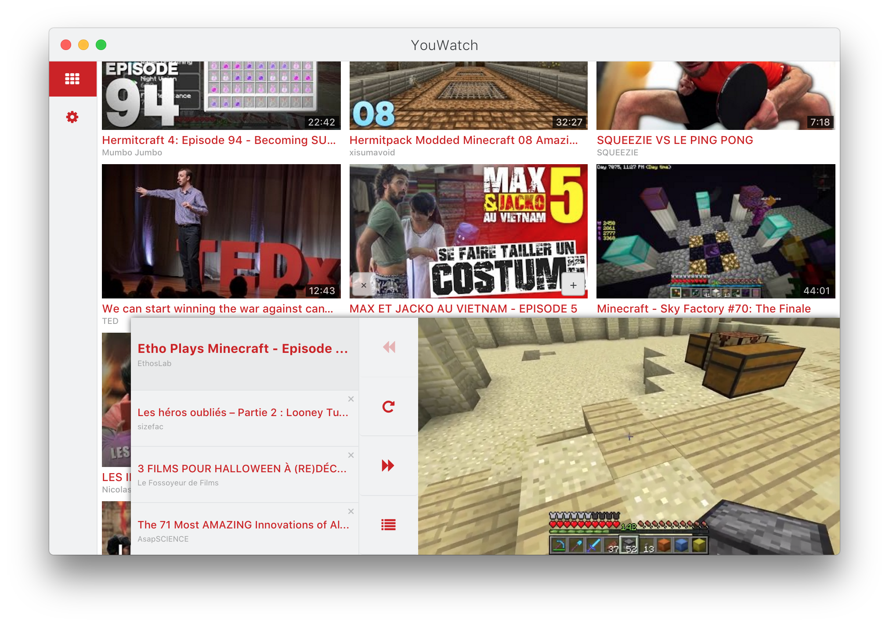
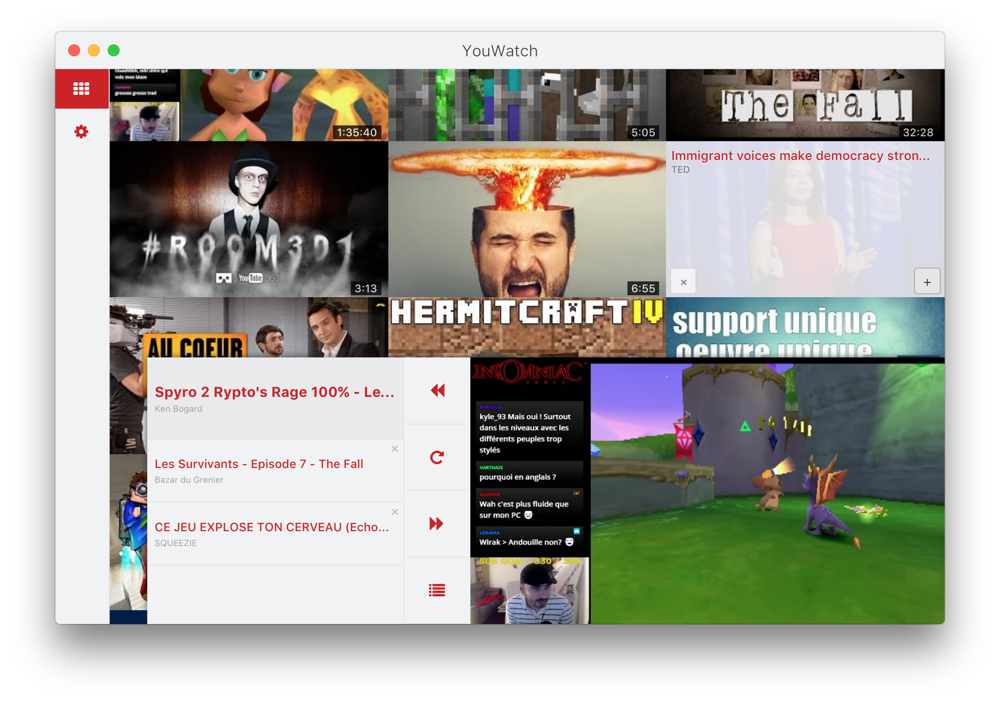
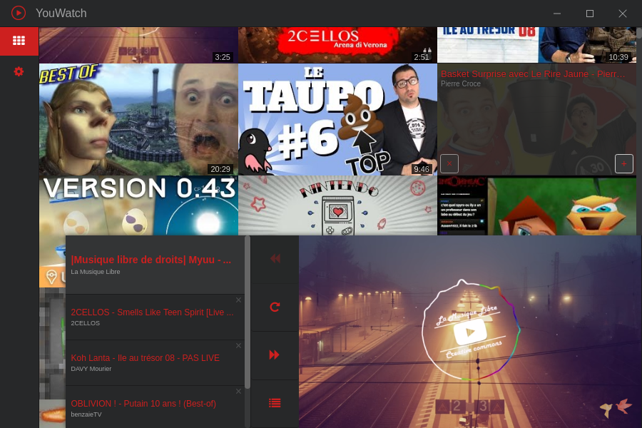
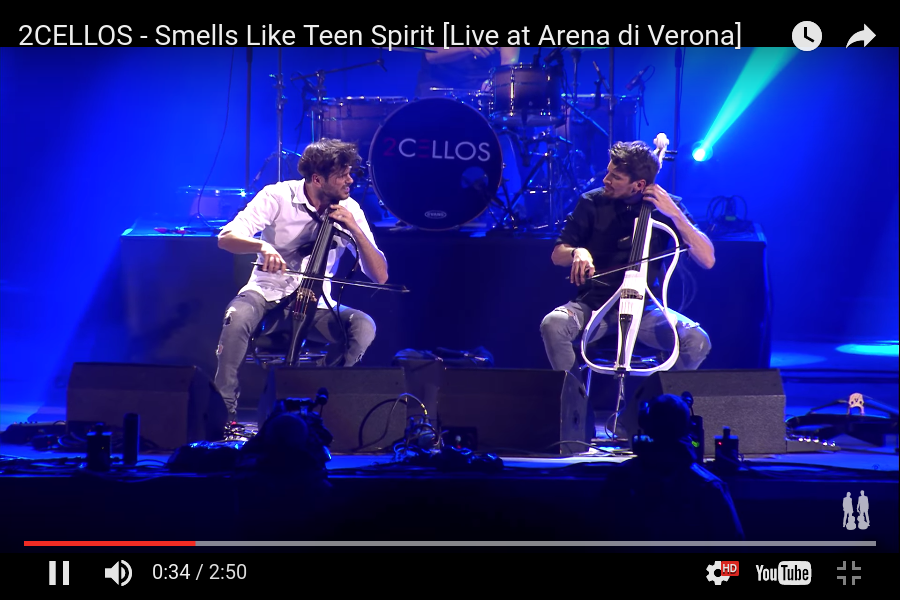

# YouWatch
**Stability: 1 - Experimental**

    

    
    
    

## Description
YouWatch is a desktop app that improves the official YouTube webapp.

* Gridifcation of the youtube subscriptions page (/feed/subscriptions)
* Create a playlist on the go
* Float-on-top mode

### Still to do

* Monitor on site activity and keeps track of which videos you've watched.
* Save a playlist for future use
* Offline mode

## Stack

    

    
    
    

## Dev
**Replace the credentials in `src/config.js` with yours.**
Use this command to avoid commiting the file:

`$ git update-index --assume-unchanged src/config.js`

### Commands
* Init: `$ yarn`
* Clean data: `$ yarn run clean`
* Run: `$ yarn start`
* Lint: `$ yarn run test`
* Build OS X: `$ yarn run build:osx`
* Build Linux: `$ yarn run build:linux`
* Build Windows: `$ yarn run build:windows`
* Build all: `$ brew install wine` and `$ yarn run build` *(OS X only)*

## License
MIT © [Yann Bertrand](http://yann-bertrand.fr)
