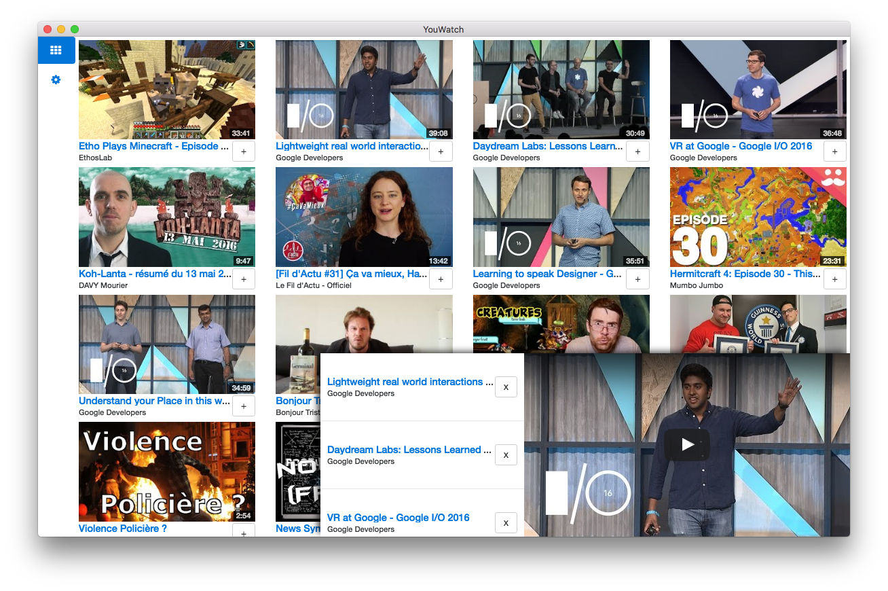

# YouWatch
**Stability: 1 - Experimental**

## Description
YouWatch is a desktop app that improves the official YouTube webapp.

* Gridifcation of the youtube subscriptions page (/feed/subscriptions)
* Monitor on site activity and keeps track of which videos you've watched.
* Create a playlist on the go
* Save a playlist for future use
* Float-on-top mode
* Offline mode

## Stack
  

## Dev
*Replace the credentials in `src/credentials.js` with yours.*

### Commands
* Init: `$ npm install`
* Clean data: `$ npm run clean`
* Run: `$ npm start`
* Build OS X: `$ npm run build:osx`
* Build Linux: `$ npm run build:linux`
* Build Windows: `$ npm run build:windows`
* Build all: `$ brew install wine` and `$ npm run build` *(OS X only)*

## License
MIT © [Yann Bertrand](http://yann-bertrand.fr)
